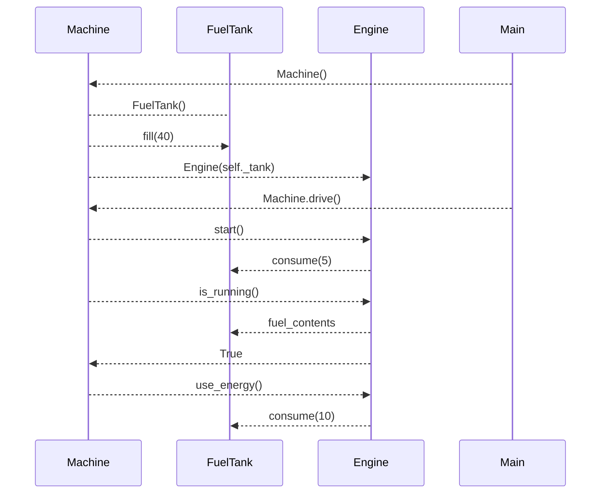

```mermaid
	sequenceDiagram
	    participant M as Machine
	    participant F as FuelTank
	    participant E as Engine    
	    
	    Main-->>M: Machine()
	    M-->F: FuelTank()
	    M-->>F: fill(40)
	    M-->>E: Engine(self._tank)
	    Main-->>M: Machine.drive()
	    M-->>E: start()
	    E-->>F: consume(5)
	    M-->>E: is_running()
	    E-->>F: fuel_contents
	    E-->>M: True
	    M-->>E: use_energy()
	    E-->>F: consume(10)
	


```
