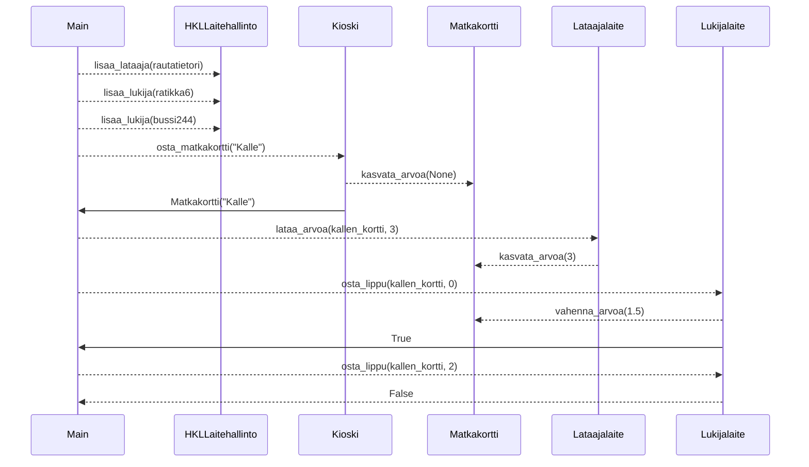

```mermaid
	sequenceDiagram
	    Main -->> HKLLaitehallinto: lisaa_lataaja(rautatietori)
	    Main -->> HKLLaitehallinto: lisaa_lukija(ratikka6)
	    Main -->> HKLLaitehallinto: lisaa_lukija(bussi244)

	    Main -->> Kioski: osta_matkakortti("Kalle")
	    Kioski -->> Matkakortti: kasvata_arvoa(None)
	    Kioski ->> Main: Matkakortti("Kalle")

	    Main -->> Lataajalaite: lataa_arvoa(kallen_kortti, 3)
	    Lataajalaite -->> Matkakortti: kasvata_arvoa(3)

	    Main -->> Lukijalaite: osta_lippu(kallen_kortti, 0)
	    Lukijalaite -->> Matkakortti: vahenna_arvoa(1.5)
	    Lukijalaite ->> Main: True
	    Main -->> Lukijalaite: osta_lippu(kallen_kortti, 2)
	    Lukijalaite -->> Main: False
```
