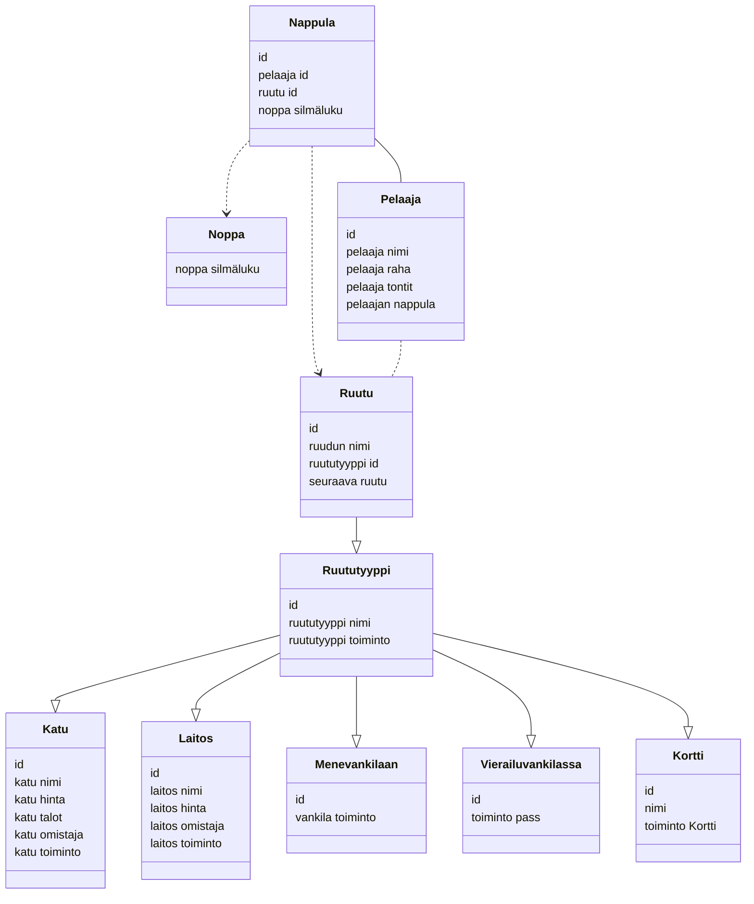

monopoli luokkakaavio

```mermaid
classDiagram
        Nappula ..> Ruutu
        Nappula ..> Noppa
        Nappula -- Pelaaja
        Pelaaja .. Ruutu
	Ruutu --|> Ruututyyppi
	Ruututyyppi --|> Katu
	Ruututyyppi --|> Laitos
	Ruututyyppi --|> Mene vankilaan
	Ruututyyppi --|> Vierailu vankilassa
	Ruututyyppi --|> Kortti


        class Nappula{
            id
            pelaaja id
            ruutu id
            noppa silmäluku
        }

        class Ruutu{
            id
            ruudun nimi
	    ruututyyppi id
            seuraava ruutu
        }

        class Ruututyyppi{
	    id
	    ruututyyppi nimi
	    ruututyyppi toiminto
	}

	class Katu{
	    id
	    katu nimi
	    katu hinta
	    katu talot
	    katu omistaja
	    katu toiminto
        }

	class Mene vankilaan{
	    id
	    vankila toiminto
	}

	class Vierailu vankilassa{
	    id
	    toiminto pass
	}

	class Laitos{
	    id
	    laitos nimi
	    laitos hinta
	    laitos omistaja
	    laitos toiminto
        }
	
	class Kortti{
	    id
	    nimi
	    toiminto Kortti
	}

	class Noppa{
            noppa silmäluku
        }
        class Pelaaja{
            id
            pelaaja nimi
            pelaaja raha
            pelaaja tontit
            pelaajan nappula    
        }
```

